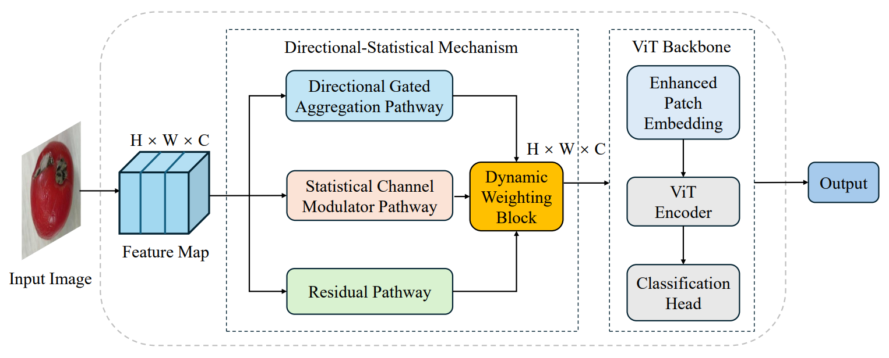
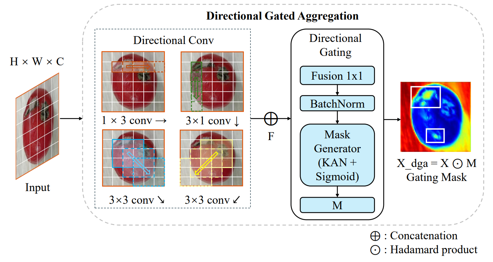
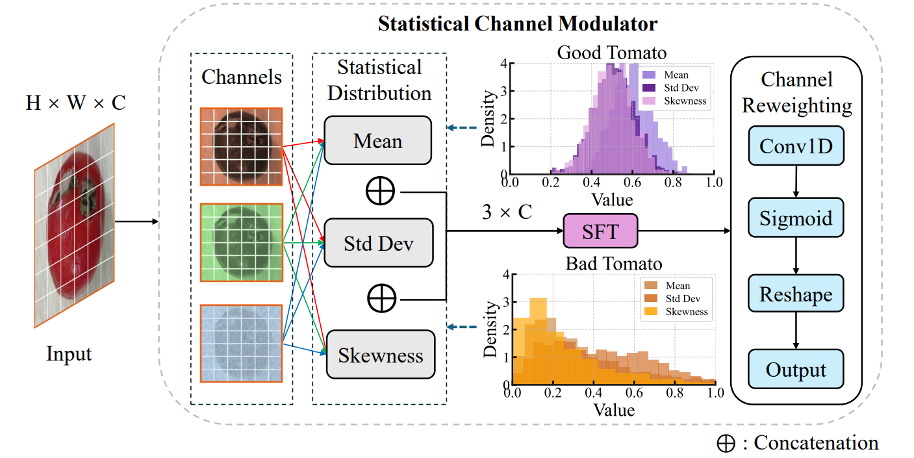

> **This paper has been accepted for publication in *Computers & Industrial Engineering*.**

# DiSFormer

Official PyTorch implementation of:

**DiSFormer: A Directional–Statistical Embedding Mechanism for Vision Transformer in Tomato Quality Classification**

## Overview

DiSFormer is a Vision Transformer-based image classification model designed for tomato quality assessment. It introduces a directional–statistical embedding mechanism before the standard ViT encoder to enrich patch representations with complementary spatial and statistical information.

The embedding mechanism contains three pathways:

- **Directional Gated Aggregation (DGA)** for orientation-sensitive spatial patterns.
- **Statistical Channel Modulator (SCM)** for channel-wise statistical reweighting based on mean, standard deviation, and skewness.
- **Residual pathway** for preserving low-level information and stabilizing feature fusion.

The resulting features are projected into patch tokens and processed by a standard Vision Transformer encoder.

## Architecture

### Overall DiSFormer Framework

<p align="center">
  
</p>

<p align="center"><em>Figure 2. Overall framework of DiSFormer.</em></p>

### Directional Gated Aggregation (DGA)

<p align="center">
  
</p>

<p align="center"><em>Figure 3. Overview of the DGA pathway.</em></p>

### Statistical Channel Modulator (SCM)

<p align="center">
  
</p>

<p align="center"><em>Figure 4. Overview of the SCM pathway.</em></p>

## Repository Structure

```text
DiSFormer/
├── classic_models/
│   ├── __init__.py
│   ├── disformer.py
│   ├── vision_transformer.py
│   ├── alexnet.py
│   ├── vggnet.py
│   ├── resnet.py
│   ├── densenet.py
│   ├── mobilenet_v3.py
│   ├── efficientnet_v2.py
│   ├── inceptionnext.py
│   └── van.py
│
├── module/
│   ├── FDS.py
│   └── SCM.py
│
├── src/
│   └── efficient_kan/
│       ├── __init__.py
│       └── kan.py
│
└── .gitignore
```

### Main Files

- `classic_models/disformer.py` — DiSFormer architecture.
- `module/FDS.py` — directional–statistical fusion block, including DGA and pathway fusion.
- `module/SCM.py` — Statistical Channel Modulator.
- `src/efficient_kan/` — KANLinear implementation used in the directional gating mechanism.
- `classic_models/vision_transformer.py` — standard ViT baseline.
- `classic_models/` — additional baseline architectures used for comparison.

## Installation

Clone the repository and install the main dependencies:

```bash
git clone https://github.com/XingrenPan/DiSFormer.git
cd DiSFormer
pip install torch timm
```

## Model Usage Example

```python
from classic_models.disformer import disformer_base_patch16_224

model = disformer_base_patch16_224(num_classes=2)
```

## Datasets

The study evaluates DiSFormer on three public tomato quality datasets:

1. **Tomato Fruits Dataset** — binary classification of Healthy and Rejected tomatoes.
2. **Tomato Quality Grading Dataset** — binary classification of Fresh and Rotten tomatoes.
3. **Tomatoes Dataset** — four-class classification of Damaged, Old, Ripe, and Unripe tomatoes.

## Evaluation Protocol

The experiments in the paper use a 10-fold cross-validation protocol. For more details, please see the paper.

## Citation

If you find this repository useful, please cite the corresponding paper:

```bibtex
@article{pan_disformer,
  title   = {DiSFormer: A Directional--Statistical Embedding Mechanism for Vision Transformer in Tomato Quality Classification},
  author  = {Pan, Xingren and Jie, Ferry and McMahon, Kathryn and Hu, Kun},
  year    = {2026}
}
```

The bibliographic entry will be updated with the final publication information when available.

## License

This repository is released for academic and research use. Please cite the paper if you use the code or build upon this work.
